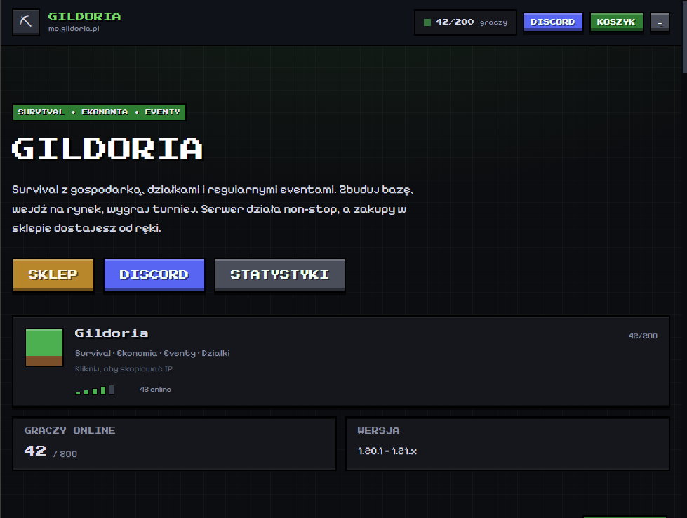
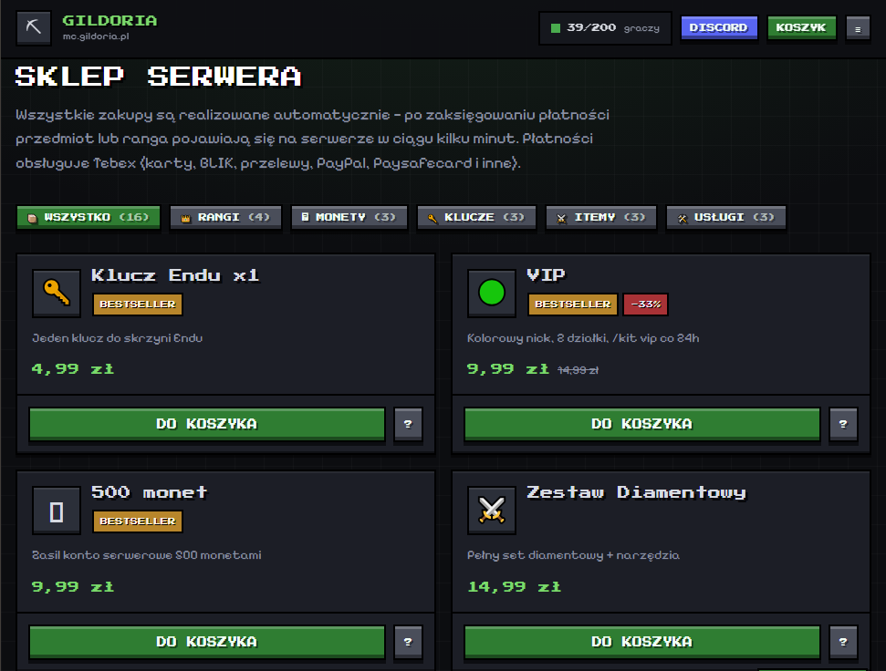
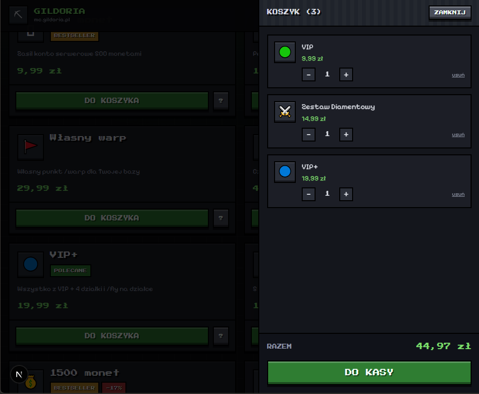
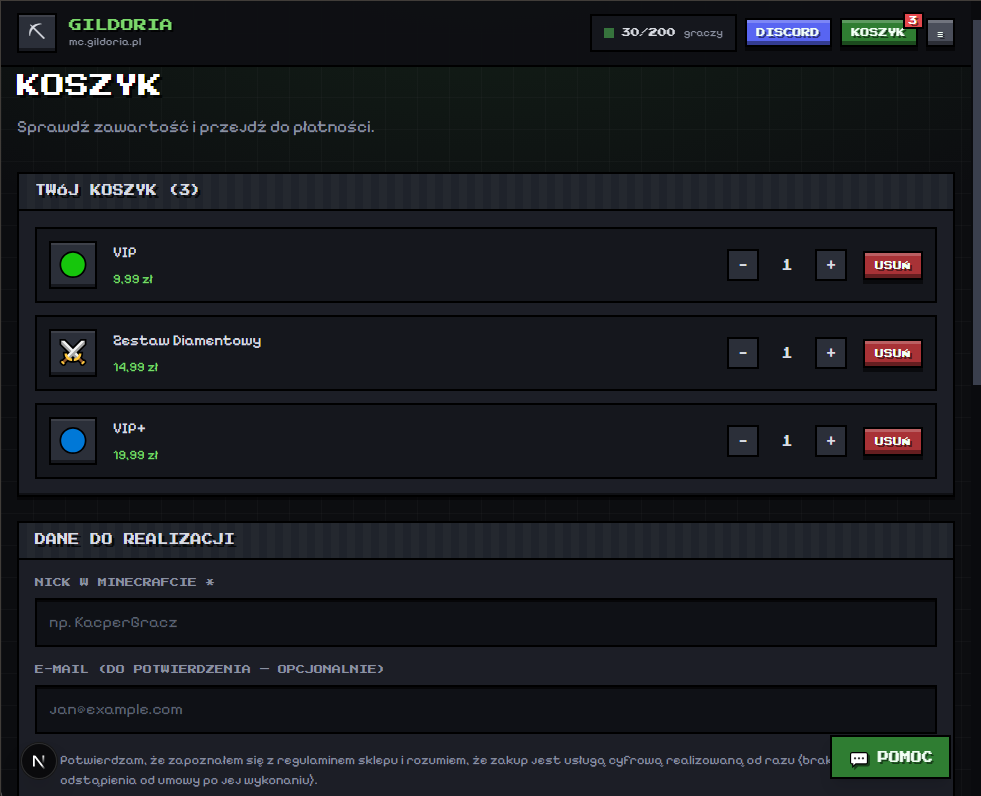
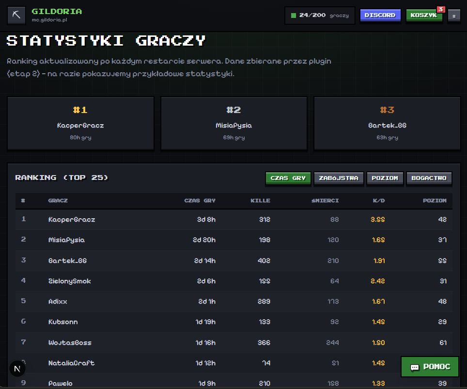

<div align="center">

# ⛏ CraftMC — Strona + Sklep serwera Minecraft

[](https://nextjs.org/)
[](https://www.typescriptlang.org/)
[](https://tailwindcss.com/)
[](https://orm.drizzle.team/)
[](https://www.sqlite.org/)

[](#)
[](#-wdrożenie-flyio)
[](#-licencja)

<br>

### 🌐 Kompletna strona serwera Minecraft: sklep, czat na żywo, statystyki, eventy, LiveHelp i gotowe wejścia pod plugin oraz bota Discord

Strona + sklep z prawdziwym procesem płatności, danymi z serwera w czasie rzeczywistym i wykrywaniem streamów.
**Klimat klasycznej strony serwera MC** — bez „AI landing page": kanciaste panele, pikselowe fonty, zero gradientów.

<br>

[📸 Screenshots](#-screenshots) •
[🛠️ Technologie](#️-technologie) •
[🚀 Uruchomienie](#-uruchomienie) •
[☁️ Wdrożenie](#-wdrożenie-flyio) •
[🔌 Integracje](#-integracje) •
[📞 Kontakt](#-kontakt)

<br>

---

</div>

<br>

## 🌐 Strona

### 🏠 Strona główna

Wszystko, co gracz musi zobaczyć w 3 sekundy: adres serwera, licznik graczy i droga do sklepu.

- ✅ **Karta serwera jak z listy w grze** — ikona bloku, MOTD, gracze online, pasek „siły sygnału"; kliknięcie kopiuje IP
- ✅ **Licznik graczy na żywo** — aktualizowany strumieniem (SSE), z paskiem zapełnienia serwera
- ✅ **Czat z serwera na żywo** — scrolluje się sam, rozróżnia wejścia/wyjścia/śmierci/osiągnięcia, maskuje wulgaryzmy
- ✅ **Feed „ostatnie zakupy"** — nicki **zamaskowane serwerowo** (`KacperGracz` → `Ka********z`)
- ✅ **Top graczy, eventy, ogłoszenia** — od razu na pierwszej stronie
- ✅ **Jak dołączyć** — trzy kroki z wersją gry i adresem

### 🛒 Sklep

- ✅ **Kategorie i paczki** — rangi, monety, klucze, itemy, usługi; kafelki jak sloty w ekwipunku
- ✅ **Koszyk** — zapisywany w przeglądarce, ilości, usuwanie, podsumowanie
- ✅ **Kasa** — nick z walidacją (3–16 znaków, tylko znaki Minecrafta), zgoda na regulamin, podsumowanie
- ✅ **Płatności Tebex** — karty, BLIK, przelewy, PayPal, Paysafecard; bramka zewnętrzna, my nie dotykamy danych karty
- ✅ **Tryb DEMO** — bez kluczy Tebex cały proces można prze klikać symulowaną płatnością
- ✅ **Status zamówienia** — kroki *oczekuje → opłacone → dostarczone*, automatyczne odświeżanie
- ✅ **Ceny liczone wyłącznie po stronie serwera** — klient wysyła tylko id paczki i ilość

### 📊 Statystyki i eventy

- ✅ **Ranking graczy** — czas gry, zabójstwa, poziom, bogactwo; sortowanie i podium top 3
- ✅ **Wyszukiwarka gracza** — pełne statystyki po nicku (K/D, monety, zbite bloki)
- ✅ **Eventy z odliczaniem** — turnieje, dropy, konkursy; status *trwa / zaplanowany / zakończony*

### 🎥 Wykrywanie streamów

- ✅ **Baner „TRWA STREAM"** — pojawia się sam, gdy ktoś streamuje serwer
- ✅ **Osadzony player Twitcha** — z tytułem, liczbą widzów i linkiem do kanału
- ✅ **Dwa źródła** — zlinkowani streamerzy (nick MC ↔ kanał) albo skan kategorii Minecraft po IP/nazwie serwera
- ✅ **Bez kluczy Twitcha** działa na danych pokazowych, żeby strona wyglądała kompletnie

### 🎧 LiveHelp i panel

- ✅ **Widget pomocy** — zgłoszenie z nickiem, tematem i opisem, bez logowania
- ✅ **Panel administracyjny** `/panel` — odpowiedzi na zgłoszenia, zamówienia, kolejka komend do serwera
- ✅ **Statystyki w panelu** — otwarte zgłoszenia, zamówienia, przychód z opłaconych
- ✅ **Dostęp** — hasło + podpisane ciasteczko HMAC (httpOnly, sameSite)

---

## 🔌 Integracje

### 🧩 Plugin Minecraft (Paper / Spigot)

Protokół HTTP — wejścia gotowe, wtyczka to osobny etap.

- ✅ **Serwer → strona**: `POST /api/ingest` — czat, wejścia/wyjścia, zgony, osiągnięcia, gracze online, TPS, wersja, eventy
- ✅ **Strona → serwer**: `GET /api/plugin/commands` — komendy do wykonania (np. nadanie rangi za zakup) oraz wiadomości ze strony na czat
- ✅ **Potwierdzenie**: `POST /api/plugin/commands` — po wykonaniu zamówienie samo dostaje status *zrealizowane*
- ✅ **Token** w nagłówku, porównywany w czasie stałym

### 💳 Płatności (Tebex)

- ✅ Koszyk tworzony przez Tebex Headless API → klient dostaje link do bramki
- ✅ **Webhook** `POST /api/webhooks/tebex` z weryfikacją podpisu **HMAC-SHA256**
- ✅ Zdarzenia: `payment.completed`, `payment.declined`, `payment.refunded`
- ✅ Po opłaceniu: komendy z paczki lecą do kolejki z podstawionym nickiem (`{nick}`, `{quantity}`, `{package}`)

### 🤖 Discord i Twitch

- ✅ **Twitch Helix** — token aplikacji z cache'm, cache streamów 60 s
- ⏳ **Bot Discord** — zaprojektowany (`/status`, `/gracz`, powiadomienia o zakupach i streamach), do implementacji w `services/bot`

---

## 🎨 Wygląd

Celowo **nie** jest to „AI landing page". Zasady zapisane w `apps/web/src/app/globals.css`:

- 🟩 **Wszystko kwadratowe** — `border-radius: 0` wymuszone globalnie
- 🔤 **Fonty pikselowe serwowane lokalnie** (Press Start 2P + Pixelify Sans przez `@fontsource`) — bez pytań do Google Fonts, szybciej i bez problemów z RODO
- 🧱 **Panele jak okno inventory** — ostra ramka, światło od góry, cień od dołu
- 🔘 **Wciskane przyciski** — efekt 3D jak w menu gry, animacje „klatkowe" (`steps()`), nie miękkie
- ⛏ **Własne ikony SVG** zamiast emoji — spójne na każdym systemie
- 🖼️ **Social preview** generowane automatycznie (`opengraph-image.tsx`) + favikona — blok trawy

---

## 📸 Screenshots

Zdjęcia wrzuć do folderu `screenshots/` pod nazwami poniżej.

### 🏠 Strona główna

Karta serwera jak z listy w grze, czat na żywo, feed zakupów z zamaskowanymi nickami, top graczy i nadchodzące eventy.



*Wszystkie dane „na żywo" — czat, gracze i zakupy aktualizują się bez przeładowania strony*

<br><br>

### 🛒 Sklep

Kafelki paczek jak sloty w ekwipunku, kategorie, odznaki (Bestseller / Promocja / Polecane).



*Sklep — ceny liczone po stronie serwera, koszyk w przeglądarce*

<br><br>

### 🧾 Koszyk i płatność

Podsumowanie, nick gracza, zgoda na regulamin i przejście do bramki (albo symulowana płatność w trybie DEMO).



*Kasa — walidacja nicku Minecrafta i podsumowanie zamówienia*

<br><br>

### 📦 Status zamówienia

Kroki *oczekuje → opłacone → dostarczone* z automatycznym odświeżaniem i podglądem komend, które poszły na serwer.



*Zamówienie — po wykonaniu komend przez plugin status zmienia się na „zrealizowane"*

<br><br>

### 📊 Statystyki

Ranking z sortowaniem, podium i wyszukiwarką gracza.



*Statystyki graczy — czas gry, K/D, poziom, bogactwo*

<br><br>

### 🛠️ Panel administracyjny

Zgłoszenia LiveHelp z odpowiedziami, zamówienia i kolejka komend do wykonania na serwerze.


*Panel — obsługa pomocy i sprzedaży w jednym miejscu*

<br><br>

### 🎥 Stream z serwera

Baner „TRWA STREAM" z osadzonym playerem — pojawia się sam po wykryciu transmisji.


*Wykrywanie streamów — po zlinkowanych kanałach albo po tytule z IP serwera*

<br>

---

## 🛠️ Technologie

| Warstwa | Technologia |
|---|---|
| Frontend | **Next.js 15** (App Router), **React 19**, **TypeScript** |
| Style | **Tailwind CSS v4** (własny design system: `mc-panel`, `mc-btn`, `mc-slot`) |
| Baza | **Drizzle ORM** + **SQLite** (produkcja: **Postgres** — zmiana 3 linii) |
| Dane na żywo | **SSE** (`/api/realtime`) + event bus w pamięci |
| Płatności | **Tebex** (Headless API + webhook HMAC) |
| Streamy | **Twitch Helix API** |
| Walidacja | **Zod** |
| Hosting | **Fly.io** (Docker + wolumen pod SQLite) |
| Jakość | `tsc --noEmit`, `next build`, rate limiting, stałoczasowe porównania tokenów |

---

## 🚀 Uruchomienie

```bash
git clone <repo> && cd mc
cp .env.example apps/web/.env

npm install
npm run db:migrate     # tworzy bazę SQLite
npm run db:seed        # paczki, gracze, eventy, przykładowe zamówienia
npm run dev            # http://localhost:3000
```

Panel: `/panel` (hasło z `ADMIN_PASSWORD`, domyślnie `admin123`).

> `node_modules` i plik bazy nie są w repozytorium — po klonie odpal trzy komendy wyżej.
> Jeśli `better-sqlite3` nie chce się zainstalować: `npm_config_nodedir=/usr/local npm install`

### Skrypty

| Komenda | Po co |
|---|---|
| `npm run dev` | serwer deweloperski |
| `npm run build` / `start` | build produkcyjny |
| `npm run db:generate` | nowa migracja po zmianie schematu |
| `npm run db:migrate` / `db:seed` / `db:reset` | baza |
| `npm run typecheck` | sprawdzenie typów |

---

## ☁️ Wdrożenie (fly.io)

```bash
fly volumes create mc_data --region waw --size 1   # PRZED pierwszym deployem
fly secrets set ADMIN_PASSWORD="..." SESSION_SECRET="..." NEXT_PUBLIC_SITE_URL="https://xxx.fly.dev"
fly deploy --build-arg NEXT_PUBLIC_SERVER_NAME="CraftMC" --build-arg NEXT_PUBLIC_SERVER_IP="mc.twojserwer.pl"
fly ssh console -C "cd /app/apps/web && npm run db:seed"
```

⚠️ Fly czyści dysk przy restarcie maszyny — **baza musi leżeć na wolumenie** (`/data`).
Zmienne `NEXT_PUBLIC_*` są wpinane w kod przy buildzie, więc idą jako **build-argi**, nie sekrety.

Szczegóły: [docs/DEPLOY.md](docs/DEPLOY.md)

---

## 📁 Struktura

```
apps/web/          Next.js — strona, sklep, API
  src/app/         strony + endpointy API
  src/components/  UI (karta serwera, czat, koszyk, LiveHelp, panel)
  src/db/          schemat Drizzle, migracje, seed
  src/lib/         integracje: tebex, twitch, orders, realtime, session
packages/core/     współdzielone typy i narzędzia (cenzura nicków, formatowanie)
docs/              ARCHITECTURE · INTEGRATIONS · DEPLOY · CHECKLIST
```

---

## 🔒 Bezpieczeństwo

- 🔐 Ceny wyliczane **wyłącznie po stronie serwera**
- 🔐 Rate limiting na checkout, czat, LiveHelp i logowanie do panelu
- 🔐 Podpis HMAC na webhooku Tebex, token pluginu porównywany w czasie stałym
- 🔐 Hasło panelu w czasie stałym + ciasteczko httpOnly / sameSite
- 🔐 Adresy IP haszowane przed zapisem
- 🔐 Nicki w publicznym feedzie zakupów **maskowane serwerowo** (tryby: `partial` / `first` / `full` / `off`)

---

## 📄 Licencja

<div align="center">

**MIT** — możesz używać, modyfikować i sprzedawać.

Copyright (c) 2026 WilkorPLYT (𝓓𝓻𝓦𝓲𝓵𝓴𝓸𝓻)

Pełny tekst: [LICENSE](LICENSE)

</div>

<br>

---

## 👨‍💻 Autor

<div align="center">

| Developer | Discord | GitHub |
|-----------|---------|--------|
| **𝓓𝓻𝓦𝓲𝓵𝓴𝓸𝓻** | [DrWilkor](https://discord.com/users/446740090757316608) | [@WilkorPLYT](https://github.com/WilkorPLYT) |

<br>

Stworzony z ❤️ przez **𝓓𝓻𝓦𝓲𝓵𝓴𝓸𝓻**

<br>

[](https://discord.com/users/446740090757316608)
[](https://github.com/WilkorPLYT)

<br>

---

**⭐ Jeśli podoba Ci się ten projekt, zostaw gwiazdkę! ⭐**

</div>
